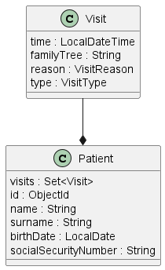

# stellato Project

This project uses Quarkus, the Supersonic Subatomic Java Framework.

If you want to learn more about Quarkus, please visit its website: https://quarkus.io/ .

## Running the application in dev mode

You can run your application in dev mode that enables live coding using:
```shell script
./mvnw compile quarkus:dev
```

Create image with docker
./mvnw package -DskipTests -Dquarkus.native.container-build=true

Then start containers with:

```shell script
docker compose -f src/main/docker/docker-compose.yaml up
```

## Diagrams

**Class diagram**



## Curl examples 

**Add new patient**
```
curl --location --request POST 'http://localhost:8080/patients' \
--header 'Content-Type: application/json' \
--data-raw '{
    "name": "Pino",
    "surname": "Scorre",
    "birthDate": "2022-01-03",
    "socialSecurityNumber": "AA123456Z"
}'
```

**Get patient information**

```
curl --location --request GET 'http://localhost:8080/patients/<objectId>' \
--header 'Accept: application/json'
```

**Add a visit for the patient**

```
curl --location --request POST 'http://localhost:8080/patients/<objectId>/visits' \
--header 'Content-Type: application/json' \
--data-raw '{
    "time": "2022-01-03 23:02",
    "reason": "RECURRING",
    "type": "HOME"
}'
```

**Update visit for the patient**

```
curl --location --request PUT 'http://localhost:8080/patients/<ObjectId>/visits/<index>' \
--header 'Content-Type: application/json' \
--data-raw '{
    "reason": "RECURRING",
    "time": "2022-01-03 23:02",
    "type": "DOCTOR_OFFICE"
}'
```

**View visit for the patient**

```
curl --location --request GET 'http://localhost:8080/patients/<ObjectId>/visits/<index>'
```

**NOTE**
The **patient** collection follow the embedded document pattern that applies to One-to-Many Relationship.

See also:

https://www.mongodb.com/docs/manual/tutorial/model-embedded-one-to-many-relationships-between-documents/
